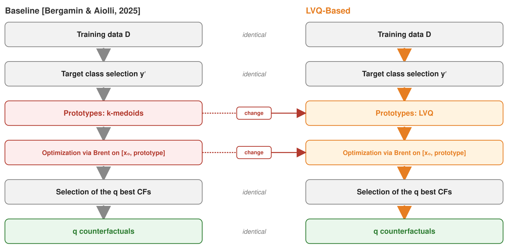

# LVQ-CF: Prototype-Based Counterfactual Explainability

Implementation of LVQ-CF, a prototype-based counterfactual explanation method, applicable to any supervised classification model.

## Description

This project proposes an extension of the Bergamin & Aiolli approach, replacing k-medoids prototypes with LVQ prototypes positioned near the decision boundary. Unlike Bergamin & Aiolli approach, LVQ-CF is designed to generalize to supervised classifier.

## Multiclass support: One-vs-Rest (OVR)

Binary datasets are straightforward: the classifier distinguishes exactly two classes, and the target class y′ is simply the alternative to the initial decision y₀.

For datasets with k > 2 classes, counterfactual generation toward a target class y′ relies on a binary classifier f_y′ trained specifically to predict that class: it learns to distinguish y′ from all other classes combined (the **One-vs-Rest** strategy). This gives every class its own dedicated binary classifier, so counterfactuals can be generated toward *any* desired target class. Generation then proceeds exactly as in the binary case: f_y′ takes the place of f, the offline-learned prototypes of y′ serve as anchors, and Brent optimization plus selection apply unchanged.

**Why OVR, rather than collapsing multiclass into a single binary problem**: the original Medoid-based baseline reduced multiclass problems to a single binary classification. This skewed the class distribution seen by the classifier, and blurred which class was actually being targeted as the counterfactual's destination. Training one binary classifier per class avoids both issues — each class can be explicitly and unambiguously selected as the target.



## Usage

### Running LVQ-CF (this project's method)

To run the proposed LVQ-CF approach on its own:

```bash
python run_final_script.py --datasets iris wine --methods lvq --dataset_type all
```

### Available arguments

| Argument | Description | Default |
|---|---|---|
| `--datasets` | Dataset(s) to use (space-separated) | `iris wine` |
| `--dataset_type` | Filter by type: `binary`, `multiclass`, or `all` | `all` |
| `--methods` | Method(s) to run | `wachter dice Medoid-based lvq` |
| `--num_iters` | Number of iterations per method | `100` |
| `--n_clusters` | Number of prototypes/clusters  | `32` |
| `--cv_grid_size` | Cross-validation grid size | `20` |
| `--max_samples` | Max samples for the train+test set | `3000` |
| `--n_counterfactuals` | Number of counterfactuals to generate per instance | `1` |
| `--clustering_method` | Clustering method  | `kmedoids` |
| `--n_jobs` | Number of parallel jobs | `1` |
| `--n_folds` | Number of cross-validation folds | `2` |

### Available datasets

- **Binary classification**: `breast_cancer`, `moons`, `boston`, `magic`, `banknote`
- **Multiclass classification**: `iris`, `wine`

### Results

Results are saved to `results_<datasets>_<methods>_<dataset_type>.csv`, with a summary table in `summary_<datasets>_<methods>_<dataset_type>.csv`.

### Metrics

Each experiment reports the following metrics for the generated counterfactuals:

| Metric | Description |
|---|---|
| Validity | Percentage of generated counterfactuals correctly classified as the target class |
| Distance L2 | Euclidean distance between the counterfactual and the original instance (proximity) |
| Distance L1 | Manhattan distance between the counterfactual and the original instance |
| Density (KDE) | Kernel density estimate at the counterfactual's location, reflecting how plausible/in-distribution it is |
| Diversity | Pairwise dissimilarity among multiple counterfactuals generated for the same instance (when `n_counterfactuals > 1`) |
---

## Comparison with baseline methods

\`\`\`bash
python run_final_script.py --datasets iris wine --methods lvq wachter dice Medoid-based --dataset_type all
\`\`\

## Method implementations 

| Method | Status | Source |
|---|---|---|
| `lvq` (**LVQ-CF**) | **This project's contribution** | — |
| `Medoid-based` | Adapted baseline | Reimplemented from [Bergamin & Aiolli](https://github.com/BouncyButton/counterfactual-svm) |
| `wachter` | Adapted baseline | Reimplemented from [Bergamin & Aiolli](https://github.com/BouncyButton/counterfactual-svm) |
| `dice` | Adapted baseline | Reimplemented from [Bergamin & Aiolli](https://github.com/BouncyButton/counterfactual-svm) |
| `nncontrastive` | External library | [AIX360](https://github.com/Trusted-AI/AIX360) (`NearestNeighborContrastiveExplainer`) |
| `cfproto` | External library | [alibi](https://github.com/SeldonIO/alibi) (Van Looveren & Klaise) |

## Supported classifiers
The approach has also been tested with **Random Forest**, using the following hyperparameter grid:

| Parameter | Values |
|---|---|
| `n_estimators` | 100, 200, 300 |
| `max_depth` | None, 5, 10, 20 |
| `min_samples_split` | 2, 5, 10 |